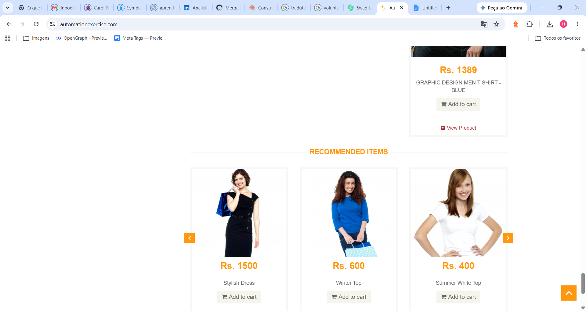
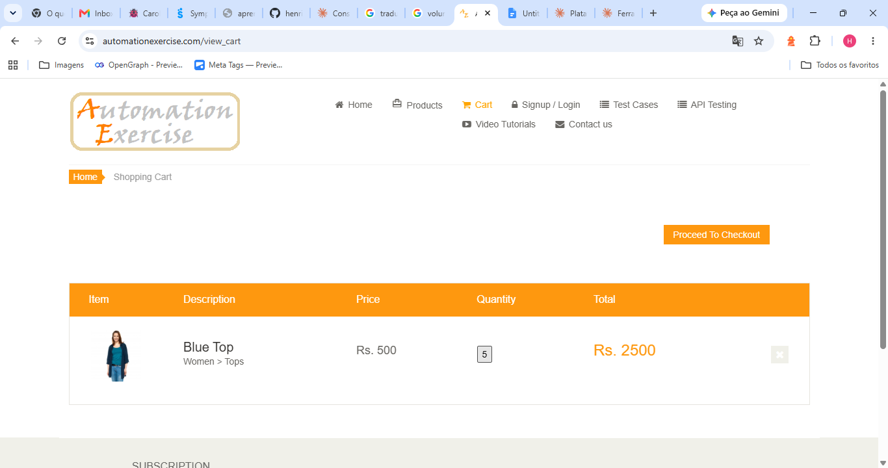
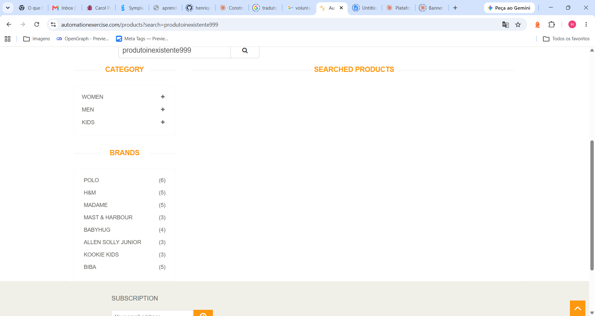
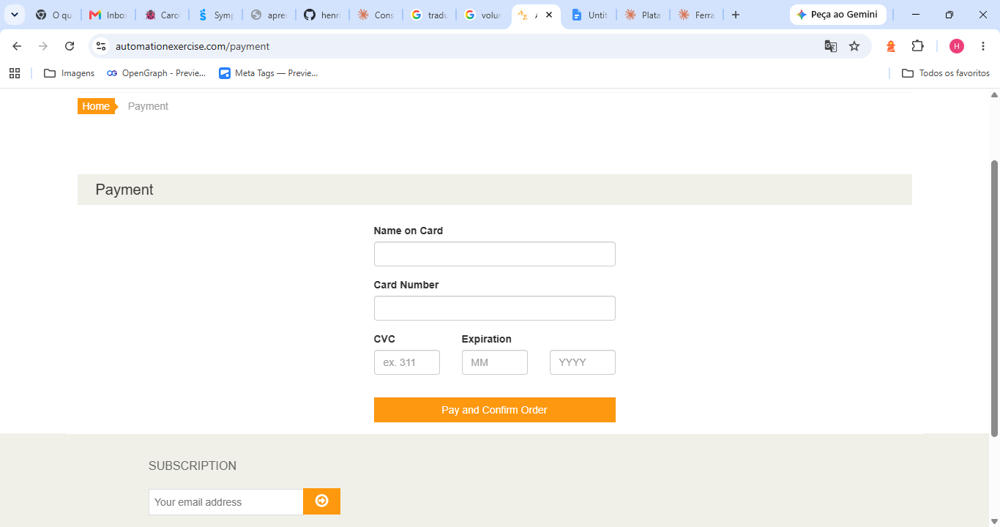

## Bug Report — BUG-001

- **ID:** BUG-001
- **Title:** Hover highlight effect is inconsistent between the main product grid and the "Recommended Items" carousel
- **Environment:** Google Chrome, Windows 11, https://automationexercise.com/products
- **Steps to Reproduce:**
  1. Go to the Products page
  2. Hover the mouse over a product card in the main grid
  3. Scroll down to the "Recommended Items" section
  4. Hover the mouse over a product card there
- **Actual Result:** The main grid shows an orange highlight background on hover. The "Recommended Items" cards show no visual change on hover.
- **Expected Result:** Both sections should have consistent hover behavior.
- **Severity:** Low
- **Priority:** Low
- **Evidence:**  

## Bug Report — BUG-002

- **ID:** BUG-002
- **Title:** Cart quantity field does not accept changes
- **Environment:** Google Chrome, Windows 11, https://automationexercise.com/view_cart
- **Steps to Reproduce:**
  1. Add a product to the cart
  2. Go to the Cart page
  3. Click directly on the quantity field
  4. Attempt to type a different value and press Enter/Tab
- **Actual Result:** The quantity value does not change, regardless of the input attempted.
- **Expected Result:** The user should be able to edit the quantity directly in the field.
- **Severity:** Medium
- **Priority:** Medium
- **Evidence:** 

## Bug Report — BUG-003

- **ID:** BUG-003
- **Title:** No feedback message when a product search returns no results
- **Environment:** Google Chrome, Windows 11, https://automationexercise.com/products
- **Steps to Reproduce:**
  1. Go to the Products page
  2. Enter a search term that matches no product (e.g., "produtoinexistente999")
  3. Click the search button
- **Actual Result:** The "SEARCHED PRODUCTS" section renders empty, with no message.
- **Expected Result:** A message such as "No products found" should be displayed.
- **Severity:** Low
- **Priority:** High
- **Evidence:** 

## Bug Report — BUG-004

- **ID:** BUG-004
- **Title:** No way to navigate back once the user reaches the Payment page
- **Environment:** Google Chrome, Windows 11, https://automationexercise.com/payment
- **Steps to Reproduce:**
  1. Add a product to the cart and proceed to Checkout
  2. Click "Place Order"
  3. On the Payment page, look for a way to go back or cancel
- **Actual Result:** No back/cancel button is available on the Payment page.
- **Expected Result:** The user should have a way to return to the previous step without using the browser's back button.
- **Severity:** Medium
- **Priority:** Medium
- **Evidence:** 

## Observation (Not Reproducible)

During initial exploratory testing, a removed cart item appeared to 
reappear after refreshing the page. This behavior was observed once 
but could not be reproduced in subsequent attempts (tested both 
logged in and as a guest). Documented here for transparency, though 
it does not meet the bar for a confirmed, reproducible defect.